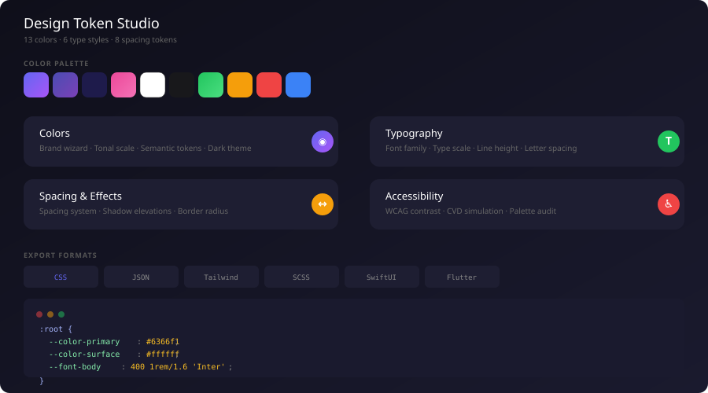

<p align="center">
  
</p>

<h1 align="center">Design Token Studio</h1>

<p align="center">
  <strong>Open Source Design Token Management</strong>
</p>

<p align="center">
  <a href="https://lov-alt.github.io/design-token-studio/"></a>
  <a href="https://github.com/lov-alt/design-token-studio/stargazers"></a>
  <a href="LICENSE"></a>
</p>

---

## Why

Design tokens are the single source of truth for a design system — colors, typography, spacing, shadows, radii. Yet managing them is fragmented:

- **Tokens Studio for Figma** is closed-source and requires a paid subscription
- **Style Dictionary (Amazon)** is powerful but CLI-only — designers can't use it
- **Custom JSON / YAML** means every team builds their own bespoke pipeline

Design Token Studio is the **missing graphical UI** on top of the W3C Design Token standard. Define tokens visually, preview them in real-time, check accessibility compliance, and export to any framework — all in the browser.

---

## Token Files — Drop into Any Project

The `tokens/` directory contains ready-to-use token exports. No build step required.

### CSS Custom Properties

```css
/* Light + dark theme, 13 colors, 6 type styles, 8 spacing, 4 shadows, 4 radii */
@import 'tokens/default-colors.css';
```

[`tokens/default-colors.css`](./tokens/default-colors.css) — Usage: `color: var(--color-primary); font: var(--font-body); padding: var(--spacing-md);`

### W3C Design Token JSON

```json
{
  "color": {
    "primary": { "$type": "color", "$value": { "light": "#6366f1", "dark": "#818cf8" } }
  },
  "typography": {
    "body": { "$type": "typography", "$value": { "fontFamily": "Inter", "fontSize": "1rem" } }
  }
}
```

[`tokens/default-theme.json`](./tokens/default-theme.json) — W3C DTCG format. Compatible with Figma Tokens Studio, Style Dictionary, Theo, Diez, and any DTCG-compliant parser.

### Tailwind Config

```ts
import tokens from './tokens/default-tailwind'
export default tokens
```

[`tokens/default-tailwind.ts`](./tokens/default-tailwind.ts) — Standalone Tailwind config with `colors`, `fontSize`, `spacing`, `boxShadow`, and `borderRadius` extensions.

---

## Features

| | |
|---|---|
| **Brand Wizard** | Enter one hex code → get a full 11-stop tonal scale (50–950) |
| **Semantic Colors** | 13 tokens with light/dark pairs: primary, surface, text, border, success, warning, error, info |
| **Image Extraction** | Upload a brand image → auto-detect the top 5 dominant colors |
| **Typography Editor** | Tabular editor for 6-level type scale (h1–caption) — all CSS text properties inline-editable |
| **Spacing System** | xs–4xl spacing scale with visual preview |
| **Shadow Elevations** | sm/md/lg/xl shadows with live preview boxes |
| **Border Radius** | Visual swatches showing each radius value |
| **Contrast Checker** | WCAG 2.x ratio with real-time AA/AAA PASS/FAIL badges |
| **CVD Simulation** | Color vision deficiency preview (protanopia, deuteranopia, tritanopia, achromatopsia) |
| **Palette Audit** | Full table of contrast ratios for all text-on-background pairs |
| **6 Export Formats** | CSS Variables, Tailwind Config, SCSS, W3C JSON, SwiftUI Colors, Flutter ThemeData |
| **Dark Mode** | System-aware + manual toggle, localStorage persisted |
| **i18n** | 中文 / English |

---

## Comparison

| | Design Token Studio | Tokens Studio for Figma | Style Dictionary |
|---|---|---|---|
| **License** | MIT · Free | Proprietary · $8/mo | Apache 2.0 · Free |
| **GUI** | Browser · Visual | Figma plugin · Visual | CLI only |
| **Token editing** | Direct input + sliders | Figma plugin nodes | JSON/YAML files |
| **Export** | CSS / Tailwind / SCSS / JSON / SwiftUI / Flutter | CSS / JSON / custom | CSS / JSON / custom |
| **Accessibility** | Built-in WCAG + CVD | Requires plugin | Manual |
| **Image extraction** | Built-in | No | No |
| **Offline** | PWA · No server | Requires Figma | Yes |

---

## Quick Start

```bash
git clone https://github.com/lov-alt/design-token-studio.git
cd design-token-studio
npm install
npm run dev          # http://localhost:5173
```

Or use it instantly at **[lov-alt.github.io/design-token-studio](https://lov-alt.github.io/design-token-studio/)**.

## Ecosystem

Design Token Studio is the design-source layer. It pairs with two other open-source tools:

```
Design Token Studio        CSS Visual Toolbox        Typography Lab
(define the system)   →    (edit CSS visually)   →   (generate layouts)
```

- **[CSS Visual Toolbox](https://github.com/lov-alt/css-visual-toolbox)** — Visual editor for clip-path, gradients, shadows, border-radius. Export to CSS / Tailwind / React / Vue / Svelte / SwiftUI / Flutter.
- **[Typography Lab](https://github.com/lov-alt/typography-lab)** — Content-driven layout generator. 14 archetypes, 8 typographic traditions, drag-and-drop canvas, local font import, image editing with 16 blend modes.

---

## Tech Stack

React 19 · TypeScript · Vite · Tailwind CSS v4 · React Router · W3C DTCG

## License

MIT
